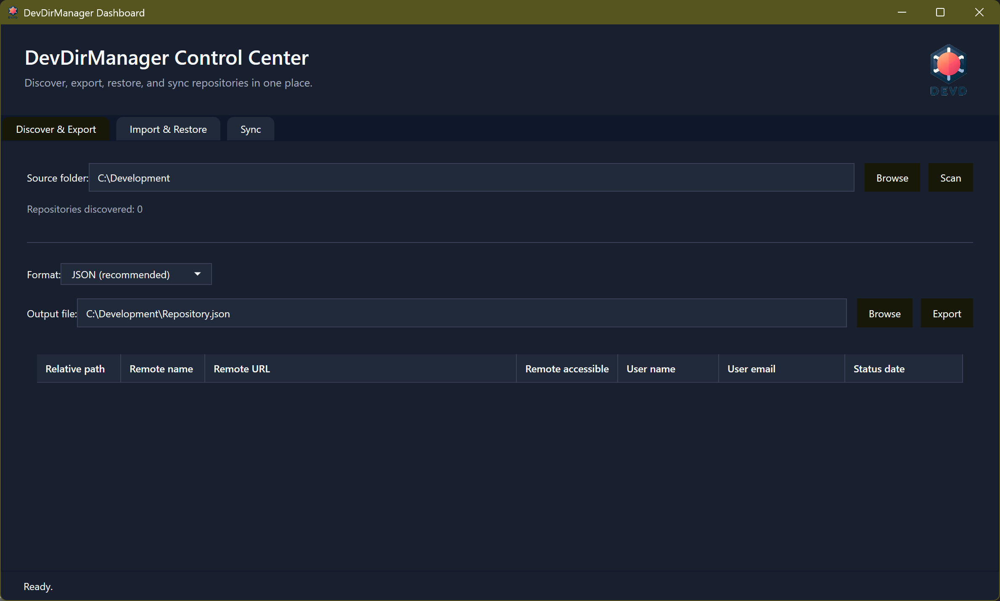
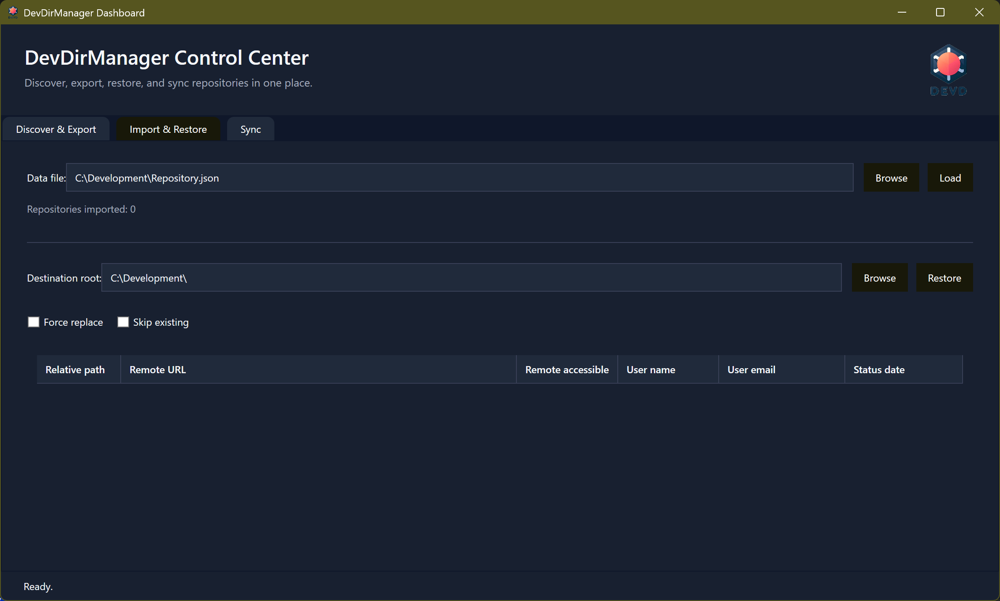
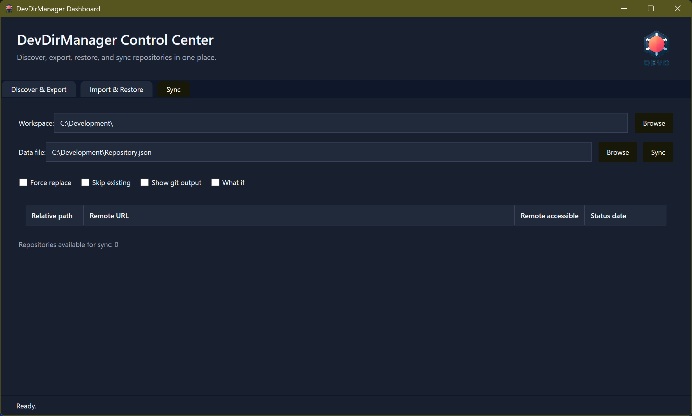

<!-- markdownlint-disable MD041 -->
#  DevDirManager - PowerShell Module for Managing Development Directory Repositories

| Platform           | Information                                                                                                                                                                                                                                                                                                                                                                                                                                                                                                                                                                                                                     |
| ------------------ | ------------------------------------------------------------------------------------------------------------------------------------------------------------------------------------------------------------------------------------------------------------------------------------------------------------------------------------------------------------------------------------------------------------------------------------------------------------------------------------------------------------------------------------------------------------------------------------------------------------------------------- |
| PowerShell Gallery | [](https://www.powershellgallery.com/packages/DevDirManager) [](https://www.powershellgallery.com/packages/DevDirManager) [](https://www.powershellgallery.com/packages/DevDirManager)                                                                                                                                                                           |
| GitHub             | [](https://github.com/AndiBellstedt/DevDirManager/releases) [](https://github.com/AndiBellstedt/DevDirManager/blob/main/LICENSE)    |

DevDirManager keeps local development folders in sync across machines. The module inventories every Git
repository beneath a directory, exports the structure to JSON or XML, restores repositories on another
computer, and even publishes or synchronises the inventory through a shared file or GitHub Gist. It is
designed for repeatable workstation setup when you maintain many repositories.

## Key Features
- Discover every Git repository below a root directory and record remote metadata.
- Export or import repository inventories in JSON or XML without losing folder hierarchy.
- Restore repositories with `git clone`, respecting existing folders via `-Force` or `-SkipExisting`.
- Publish or synchronise inventories so multiple machines stay aligned.

## How to Use DevDirManager

### Installation from PowerShell Gallery

The easiest way to install DevDirManager is directly from the PowerShell Gallery:

```powershell
# Install the module (run as administrator for system-wide installation)
Install-Module -Name DevDirManager -Scope AllUsers

# Or install for current user only (no admin rights required)
Install-Module -Name DevDirManager -Scope CurrentUser

# Import the module
Import-Module DevDirManager
```

### Installation Manually from GitHub

If you prefer to install from source or need a specific development branch, use the provided installation script:

```powershell
# Download and run the install script from GitHub
Invoke-Expression (Invoke-WebRequest -Uri "https://raw.githubusercontent.com/AndiBellstedt/DevDirManager/main/install.ps1" -UseBasicParsing).Content

# Or download manually and execute with parameters:
# Install the main branch to program files (requires admin rights)
.\install.ps1 -Branch main

# Install the development branch for the current user
.\install.ps1 -Branch Development -Scope CurrentUser

# Force overwrite an existing installation
.\install.ps1 -Force
```

The install script downloads the specified branch as a ZIP file, extracts it, and copies the module to the appropriate PowerShell modules directory.

### Using DevDirManager via Command Line

DevDirManager provides several PowerShell cmdlets for managing your Git repository collections. Here are the main workflows:

#### Discovering Repositories

Scan a directory tree to find all Git repositories and retrieve their metadata:

```powershell
# Discover all repositories under a root path
$repositories = Get-DevDirectory -RootPath "C:\Projects"

# The result includes remote URLs, user configuration, and relative paths
$repositories | Format-Table RelativePath, RemoteUrl, UserName, UserEmail
```

#### Exporting Repository Inventories

Export discovered repositories to a file for backup, version control, or sharing:

```powershell
# Export to JSON (recommended format)
$repositories | Export-DevDirectoryList -Path "C:\backup\my-repos.json" -Format JSON

# Export to CSV (for Excel or other tools)
$repositories | Export-DevDirectoryList -Path "C:\backup\my-repos.csv" -Format CSV

# Export to XML (PowerShell native format)
$repositories | Export-DevDirectoryList -Path "C:\backup\my-repos.xml" -Format XML
```

#### Importing Repository Lists

Load repository metadata from previously exported files:

```powershell
# Import from any supported format (auto-detected by file extension)
$importedRepos = Import-DevDirectoryList -Path "C:\backup\my-repos.json"

# View the imported data
$importedRepos | Select-Object RelativePath, RemoteUrl, IsRemoteAccessible
```

#### Restoring Repositories

Clone repositories from an imported list to recreate your development environment:

```powershell
# Preview what would be cloned (WhatIf mode)
Import-DevDirectoryList -Path "C:\backup\my-repos.json" |
    Restore-DevDirectory -DestinationPath "D:\NewMachine\Projects" -WhatIf

# Actually clone the repositories
Import-DevDirectoryList -Path "C:\backup\my-repos.json" |
    Restore-DevDirectory -DestinationPath "D:\NewMachine\Projects"

# Skip repositories that already exist
Import-DevDirectoryList -Path "C:\backup\my-repos.json" |
    Restore-DevDirectory -DestinationPath "D:\Projects" -SkipExisting

# Force overwrite existing repositories
Import-DevDirectoryList -Path "C:\backup\my-repos.json" |
    Restore-DevDirectory -DestinationPath "D:\Projects" -Force
```

#### Synchronizing Directories

Keep a directory synchronized with a reference repository list:

```powershell
# Synchronize a directory with a list file (preview mode)
Sync-DevDirectoryList -DirectoryPath "C:\Projects" `
    -RepositoryListPath "C:\backup\my-repos.json" `
    -WhatIf

# Perform actual synchronization and return the merged result
$syncResult = Sync-DevDirectoryList -DirectoryPath "C:\Projects" `
    -RepositoryListPath "C:\backup\my-repos.json" `
    -PassThru

# Skip existing repositories during sync
Sync-DevDirectoryList -DirectoryPath "C:\Projects" `
    -RepositoryListPath "C:\backup\my-repos.json" `
    -SkipExisting
```

#### Publishing to GitHub Gist

Share your repository inventory via GitHub Gist for cloud-based synchronization:

```powershell
# Publish a repository list to a new Gist (requires GitHub token with gist scope)
$gistUrl = Publish-DevDirectoryList -Path "C:\backup\my-repos.json" `
    -AccessToken (Get-Secret "GitHubGistToken")

Write-Host "Gist published at: $gistUrl"

# Update an existing Gist with new data
Publish-DevDirectoryList -Path "C:\backup\my-repos.json" `
    -GistId "abc123def456" `
    -AccessToken (Get-Secret "GitHubGistToken")
```

**Pro Tips for Command Line Usage:**
- Always use `-WhatIf` first to preview destructive operations like `Restore-DevDirectory` and `Sync-DevDirectoryList`
- Combine cmdlets in pipelines for efficient workflows
- Use `-Verbose` to see detailed progress information during long-running operations
- Store repository lists in version control (e.g., Git) for change tracking over time
- Use GitHub Gists for cross-machine synchronization without managing file locations

### Using DevDirManager via Graphical UI

For users who prefer a graphical interface, DevDirManager includes a modern, theme-aware dashboard that provides point-and-click access to all functionality:

```powershell
# Launch the dashboard
Show-DevDirectoryDashboard

# Or pre-populate the source directory
Show-DevDirectoryDashboard -RootPath "C:\Projects"
```

The dashboard automatically detects your Windows theme (light/dark mode) and features three main tabs:

#### Discover & Export Tab

Use this tab to scan directories and export repository inventories:



**Workflow:**
1. Enter or browse to a source folder containing your Git repositories
2. Click **Scan** to discover all repositories beneath that folder
3. Review the discovered repositories in the data grid (shows path, remote URL, accessibility, user info, and status)
4. Select an export format (JSON, CSV, or XML)
5. Choose an output file location
6. Click **Export** to save the inventory

**Benefits:**
- Visual feedback with repository count and status messages
- See all repository metadata at a glance
- Verify remote accessibility before exporting
- Choose the best format for your workflow

#### Import & Restore Tab

Use this tab to load repository lists and clone them to a new location:



**Workflow:**
1. Browse to and load a previously exported repository list file (JSON, CSV, or XML)
2. Review the loaded repositories in the data grid
3. Enter or browse to a destination folder where repositories should be cloned
4. Configure restore options:
   - **Force**: Overwrite existing repositories
   - **SkipExisting**: Skip repositories that already exist in the destination
5. Click **Restore** to begin cloning operations

**Benefits:**
- Preview repository data before restoring
- See which repositories are accessible before starting
- Visual progress indication during clone operations
- Control handling of existing repositories with checkboxes

#### Sync Tab

Use this tab to synchronize a local directory with a reference repository list:



**Workflow:**
1. Enter or browse to the directory you want to synchronize
2. Load a reference repository list file
3. Configure sync options:
   - **Force**: Overwrite existing repositories that differ from the list
   - **SkipExisting**: Don't modify repositories that already exist
   - **ShowGitOutput**: Display detailed Git command output
   - **WhatIf**: Preview changes without actually executing them
4. Click **Sync** to synchronize the directory with the reference list
5. Review the synchronized repositories in the results grid

**Benefits:**
- Keep development environments consistent across multiple machines
- Preview sync operations with WhatIf mode before committing changes
- See detailed Git output for troubleshooting
- Understand exactly which repositories will be created, updated, or skipped

**Dashboard Features:**
- **Automatic Theme Detection**: Matches Windows light/dark mode preference
- **Path Synchronization**: File paths automatically sync between Import and Sync tabs
- **Real-time Status Updates**: Progress messages appear in the status bar
- **Resizable Columns**: Adjust grid columns to see all data
- **Localization**: Available in English, Spanish, French, and German

**Pro Tips for UI Usage:**
- Use the dashboard for initial setup and discovery of your repository structure
- Switch between tabs freely - imported data remains available for restore or sync operations
- The UI is ideal for users who prefer visual feedback over command-line output
- Use `-WhatIf` mode in the Sync tab to safely preview changes before applying them
